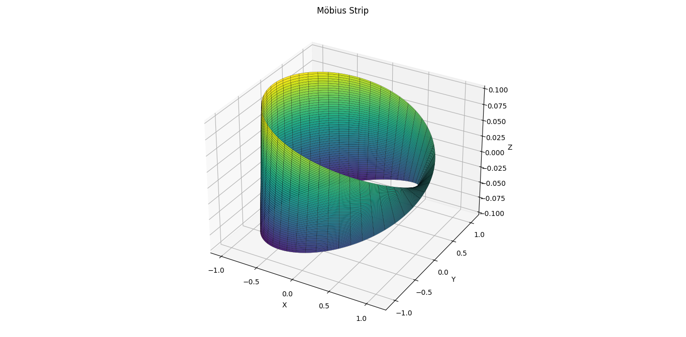

# Möbius Strip Modeling and Geometric Analysis

This project models a Möbius strip using parametric equations in Python, computes its surface area and edge length numerically, and visualizes the 3D surface.


## Code Structure

The code is organized into a clean, modular `MobiusStrip` class encapsulating all functionalities:
- Mesh generation
- Surface area and edge length calculation
- 3D plotting

Initialization sets user-defined parameters and generates the parametric grid. Each computation method leverages NumPy arrays for efficient vectorized operations. The `plot()` method uses Matplotlib’s 3D plotting API with customizable styling for clear visual output.

---

## Surface Area Approximation

Surface area is estimated using differential geometry:
- Compute partial derivatives of the position vector with respect to parameters `u` and `v`
- Take the norm of the cross product of these derivatives to get the local area element
- Use SciPy’s `simpson` rule to integrate over the entire surface mesh for accurate approximation

---

## Challenges Faced

- Achieving numerical stability and precision required fine-tuning mesh resolution and careful vectorized gradient calculations  
- Correctly parameterizing the Möbius strip to wrap seamlessly involved trigonometric precision  
- Edge length estimation demanded consistent boundary handling to avoid distortions in length computation

---

## ▶️ How to Run

1. Install dependencies:
   ```bash
   pip install numpy matplotlib scipy
2. Run
   ```bash
   python mobius_strip.py

## 🔧 Inputs

| Parameter | Description              | Value Used  |
|-----------|--------------------------|-------------|
| `R`       | Radius                   | 1.0         |
| `w`       | Width of the strip       | 0.2         |
| `n`       | Resolution (mesh points) | 200         |

---

## 🧮 Results

| Metric         | Value         |
|----------------|---------------|
| Surface Area   | ≈ 0.00003989  |
| Edge Length    | ≈ 6.3216      |

---

## 📊 Visualization

The Möbius strip is visualized using `matplotlib.pyplot.plot_surface()` as a smooth twisted surface with proper shading and 3D orientation.




